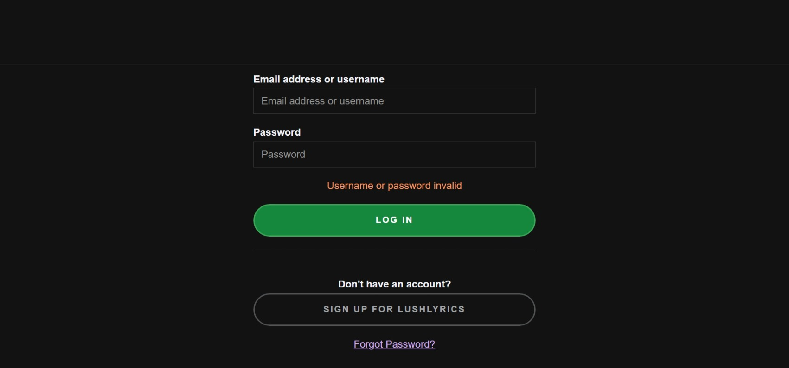
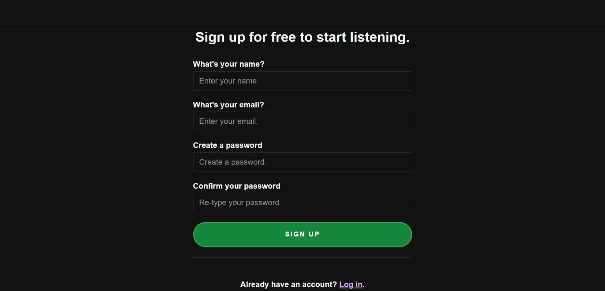
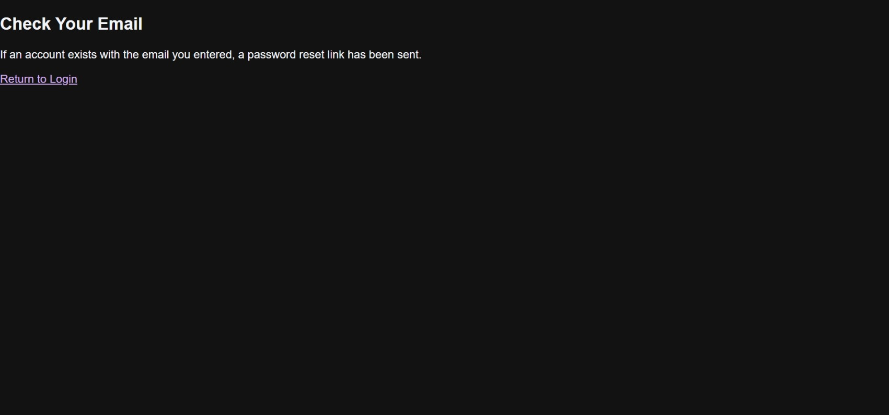

<<<<<<< HEAD
# LushLyrics Login System 🎶🔐

A secure and user-friendly login system built with Django for the LushLyrics platform.

## Features
- User registration and login
- Password reset via email
- Responsive UI with screenshots
- SQLite database integration

## Screenshots




## Setup

The first thing to do is to clone the repository:

```sh

$ git clone https://github.com/mohammedwed/lushlyrics-webapp-django.git
$ git clone https://github.com/mohammedwed/Lushlyrics-insecure.git

$ cd lushlyrics-webapp-django
```

Create a virtual environment to install dependencies in and activate it:

```sh
$ virtualenv2 --no-site-packages env
$ source env/bin/activate
```

Then install the dependencies:

```sh
(env)$ pip install -r requirements.txt
```
Note the `(env)` in front of the prompt. This indicates that this terminal
session operates in a virtual environment set up by `virtualenv2`.

Once `pip` has finished downloading the dependencies:
```sh

(env)$ cd spotify-clone-django
(env)$ python manage.py runserver
```
And navigate to `http://127.0.0.1:8000/demo`.
# Youttify Authentication System

Welcome to **Youttify**, a secure and user-friendly authentication system built for the **Lushlyrics** platform. This project demonstrates a complete user login experience using Django, with a focus on functionality, usability, and reliability.


## 🔐 Project Overview

The goal of this project is to implement a robust authentication workflow that ensures only registered users can access protected content, while providing intuitive interfaces for registration, login, password recovery, and logout.

## ✅ Features Implemented

- **User Registration**  
  Users can create accounts with valid credentials and are redirected to the login page upon successful signup.

- **Login & Logout**  
  Authenticated users can log in and securely log out, returning to the homepage.

- **Password Reset Flow**  
  Users who forget their password can initiate a reset via email. The system confirms the request with a “Check Your Email” message and provides a link to return to login.

- **Access Control**  
  Anonymous users are restricted from accessing protected pages. Only authenticated users can view secure content.

- **Error Handling**  
  Invalid login attempts are clearly flagged with styled error messages. Missing templates have been resolved to prevent crashes.

- **Responsive UI**  
  All forms are styled with `formStyle.css` for a clean and consistent look across devices.

## 📌 Technologies Used

- **Backend**: Django (Python)
- **Frontend**: HTML, CSS
- **Templating**: Django Templates
- **Static Files**: Managed via Django's `static` system

## 🚀 Next Steps (Optional Enhancements)

To further improve the system and impress potential employers, consider building:

- **Email Confirmation After Registration**  
  Verify user email before activating accounts.

- **“Remember Me” Functionality**  
  Allow users to stay logged in across sessions.

- **AJAX Form Submission**  
  Improve UX with real-time validation and feedback.

- **Mobile Responsiveness**  
  Optimize layout and styling for smaller screens.

- **Unit Tests**  
  Add automated tests for login, registration, and password reset flows.

## 📂 Project Structure


(env)$ cd Lushlyrics-insecure
(env)$ python manage.py runserver
```
And navigate to `http://127.0.0.1:8000/`.

